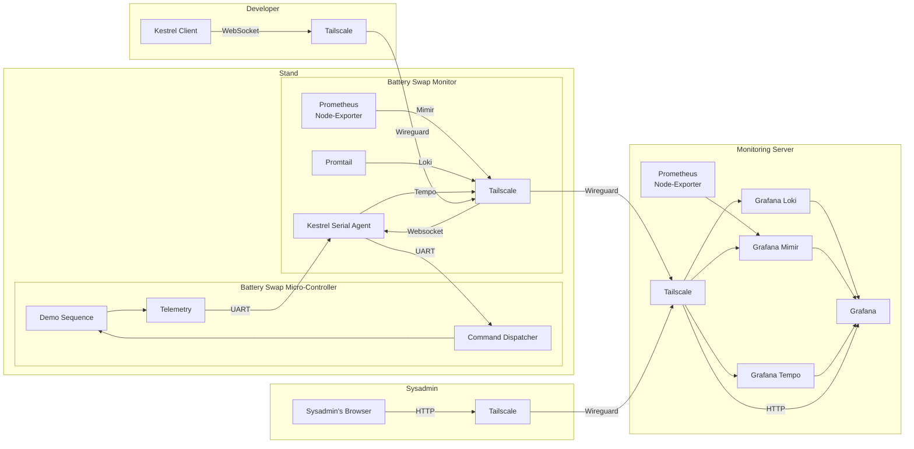

# kestrel

## Remote deployment of kestrel-serial-agent

| Service                  | Units                            | Function       |
| ------------------------ | -------------------------------- | -------------- |
| Kestrel Serial Agent     | kestrel.service, kestrel.socket? | Serial Daemon? |
| Prometheus Node-Exporter | ...                              | Telemetry      |
| Tailscale                | ...                              | Connectivity   |

### Aggregate Server

| Service       | Units | Function        |
| ------------- | ----- | --------------- |
| Grafana Loki  | ...   | Log Aggregation |
| Grafana Tempo | ...   | Tracing Backend |
| Grafana Mimir | ...   | Metric Backend  |

### Kestrel Client

| S              |
| -------------- |
| Kestrel Client |
| Tailscale      |
